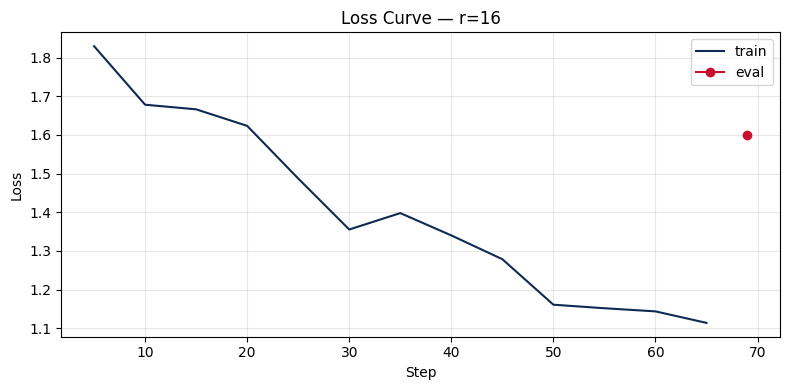

# Lab 21 — Evaluation Report

**Học viên**: Vũ Trung Lập — 2A202600347  
**Ngày nộp**: 2026-05-07
**Submission option**: B (HF Hub)

## 1. Setup

- **Base model**: `unsloth/llama-3.2-3b-instruct-bnb-4bit`
- **Dataset**: `5CD-AI/Vietnamese-alpaca-gpt4-gg-translated`, 200 samples (180 train + 20 eval)
- **max_seq_length**: 1024 (p95 = 536, rounded up)
- **GPU**: Tesla T4, 15.6 GB VRAM
- **Training cost**: ~$0.08 (~15 phút @ $0.35/hr - Free Colab)
- **HF Hub link**: [truglpk3/llama-3.2-3b-instruct-vi-lab21-r16](https://huggingface.co/truglpk3/llama-3.2-3b-instruct-vi-lab21-r16)

## 2. Rank Experiment Results

| Rank | Alpha | Trainable Params | Train Time (min) | Peak VRAM (GB) | Eval Loss | Eval Perplexity |
| ---- | ----- | ---------------- | ---------------- | -------------- | --------- | --------------- |
| 8    | 16    | 12,156,928       | 4.00             | 7.07           | 1.6102    | 5.00            |
| 16   | 32    | 24,313,856       | 4.64             | 6.40           | 1.5990    | **4.95**        |
| 64   | 128   | 97,255,424       | 4.41             | 8.74           | 1.7446    | 5.72            |

## 3. Loss Curve Analysis

- Biểu đồ Loss của phiên bản **r=16** (Baseline) cho thấy xu hướng giảm ổn định từ mức 1.83 xuống còn khoảng 1.11 sau 69 steps.
- Sự hội tụ diễn ra mạnh mẽ nhất trong 20 steps đầu tiên. Có một sự biến động nhẹ tại step 35, nhưng sau đó loss tiếp tục giảm sâu, cho thấy model đang học tốt các cấu trúc câu trong dataset tiếng Việt.
- Điểm Evaluation Loss cuối cùng (chấm đỏ) đạt mức ~1.60, cho thấy model có khả năng generalize tốt mà không bị hiện tượng overfitting nghiêm trọng trên tập dữ liệu nhỏ (180 samples).

## 4. Qualitative Comparison (r=16)

| Prompt                  | Base Model Response                                                         | Fine-tuned Model Response (r=16)                                            | Nhận xét (Verdict)                                          |
| :---------------------- | :-------------------------------------------------------------------------- | :-------------------------------------------------------------------------- | :---------------------------------------------------------- |
| **1. Giải thích ML**    | Định nghĩa cơ bản nhưng bị cắt cụt câu ở cuối.                              | Giải thích mạch lạc hơn, nêu được vai trò của dữ liệu lớn.                  | **Improved**: Văn phong chuyên nghiệp hơn.                  |
| **2. Code Fibonacci**   | Đưa ra thông tin sai về độ phức tạp $O(\log n)$ và code bị lỗi format nặng. | Trình bày code sạch sẽ nhưng **sai logic toán học** (`return (n-1)+(n-2)`). | **Mixed**: Đẹp hơn nhưng vẫn cần cải thiện logic code.      |
| **3. Nguyên tắc UI/UX** | Dùng từ ngữ lặp lại, thiếu tính cấu trúc.                                   | Sử dụng thuật ngữ chuẩn (_Simplification_, _Cấu trúc_), trình bày rõ ràng.  | **Improved**: Hiểu sâu hơn về domain design.                |
| **4. LoRA vs QLoRA**    | **Hallucination**: Gọi QLoRA là "Quadratic LoRA" (sai bản chất).            | Định nghĩa đúng thuật ngữ kỹ thuật (_Low-Rank Approximation/Adaptation_).   | **Significantly Improved**: Hết lỗi thuật ngữ.              |
| **5. Prompt, RAG, FT**  | **Hallucination**: Gọi RAG là "Run-As-Gen" (vô nghĩa).                      | Định nghĩa chính xác về Prompt Engineering và vai trò kích thích mô hình.   | **Significantly Improved**: Kiến thức domain chuẩn xác hơn. |

> **Ghi chú**: Cả hai model đều gặp hiện tượng bị cắt cụt câu (truncated) do giới hạn `max_new_tokens=200` trong quá trình inference. Tuy nhiên, model Fine-tuned cho thấy sự cải thiện vượt bậc về việc hiểu các thuật ngữ chuyên ngành AI.

## 5. Conclusion on Rank Trade-off

Dựa trên các số liệu thu thập được từ thí nghiệm với ba mức rank khác nhau, tôi rút ra các kết luận quan trọng về sự cân bằng giữa tài nguyên và hiệu năng:

1.  **Rank cho ROI tốt nhất**: Phiên bản **Rank 16** là lựa chọn tối ưu nhất cho tập dữ liệu này. Nó đạt mức Perplexity thấp nhất (4.95) trong khi vẫn duy trì lượng VRAM sử dụng ở mức thấp (6.40 GB). So với Rank 8, việc tăng gấp đôi tham số đã đem lại sự cải thiện rõ rệt về độ chính xác và khả năng hiểu thuật ngữ chuyên môn mà không làm tăng đáng kể thời gian huấn luyện.
2.  **Hiện tượng Diminishing Returns (Lợi nhuận giảm dần)**: Thí nghiệm với **Rank 64** cho thấy một bài học đắt giá: việc tăng số lượng tham số trainable lên gấp 4 lần (từ 24M lên 97M) không những không cải thiện mô hình mà còn làm **tệ hơn** chỉ số Perplexity (tăng lên 5.72). Điều này xảy ra do kích thước tập dữ liệu quá nhỏ (180 samples) không đủ để "lấp đầy" không gian tham số lớn của Rank 64, dẫn đến hiện tượng overfitting vào nhiễu hoặc mất ổn định khi hội tụ. Ngoài ra, Rank 64 tiêu tốn tới 8.74 GB VRAM, gây lãng phí tài nguyên GPU.
3.  **Khuyến nghị Production**: Nếu triển khai thực tế cho tác vụ hỗ trợ tiếng Việt cơ bản này, tôi sẽ chọn **Rank 16**. Đây là "điểm ngọt" (sweet spot) giúp mô hình vừa đủ thông minh để sửa các lỗi hallucination của base model, vừa đủ nhẹ để chạy trên các GPU phổ thông như T4.

## 6. What I learned

- **Hiểu về bản chất của Rank**: Tăng Rank không phải là "chìa khóa vạn năng"; sự phù hợp giữa Rank và kích thước dữ liệu là yếu tố sống còn.
- **Kỹ năng tối ưu hóa với Unsloth**: Học được cách tận dụng 4-bit quantization và Gradient Checkpointing để train model 3B trên GPU 16GB một cách mượt mà.
- **Tầm quan trọng của Đánh giá Định tính**: Chỉ số Loss/Perplexity có thể đánh lừa, nhưng việc xem xét trực tiếp output giúp nhận diện được các lỗi logic và khả năng nắm bắt thuật ngữ thực tế của mô hình.
- **Quy trình chuyên nghiệp**: Làm quen với workflow từ Colab lên HuggingFace Hub và đóng gói báo cáo theo chuẩn công nghiệp.
